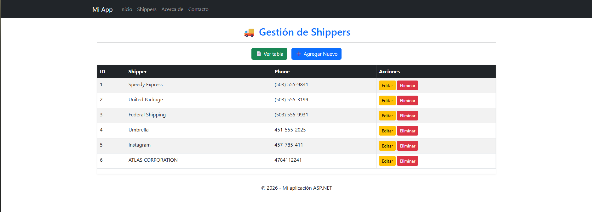

🔴🟡🟢

 

## 👤​​ Uso de AJAX y ASP.NET con conexión a SQL Server

**AJAX y ASP.NET**

<picture>
  
</picture>

Este repositorio contiene **el desarrollo de la guia 5 de DPWA** que facilitan la implementación de AJAX con C# y ASP.NET

✅ C#  
✅ CSHTML 
✅ AJAX 
✅ SQL Server 
✅ CSHTML 

---

## 🎯 Propósito

Este proyecto está diseñado como práctica de **desarrollo web de páginas web activas**, enfocado en el uso de AJAX con C#.

---

## Sitio Web

<figure>
  
</figure>

## Datos ingresados

<figure>
  
</figure>

## Mayores a 25 años
<figure>
  
</figure>

## Rango de edades entre 23 y 25 años
<figure>
  
</figure>

## Total y promedio de las becas
<figure>
  
</figure>

## Estudiantes con apellido con "re"
<figure>
  
</figure>

## El nombre más largo registrado
<figure>
  
</figure>

 

---
## ✨ Autor

Vladimir Ascencio – Desarrollador en aprendizaje continuo 🚀

¡Gracias por visitar este proyecto! 🧑‍💻

---

<h3 align="left">🔎 Contactos</h3>
<table align="center">
  <tr>
    <td align="center">
      
    </td>
    <td align="center">
      
    </td>
    <td align="center">
      
    </td>
    <td align="center">
      
    </td>
  </tr>
</table>

  

  ---

<!-- Footer -->

  

